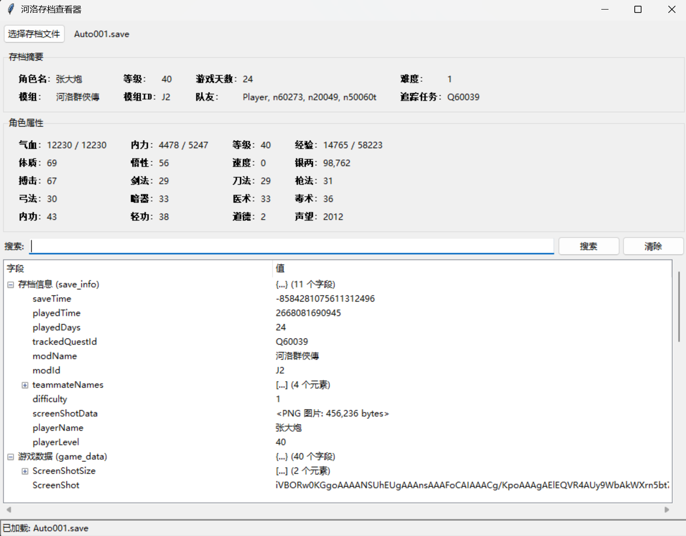

# HeluoSaveViewer

河洛英雄传存档查看器。一个用于读取和浏览 `.save` 存档内容的本地桌面小工具，支持查看存档摘要、角色属性、完整数据树以及关键字搜索。



> `ui-example.png` 仅作为界面示例图使用，不是程序运行依赖。

## 功能特性

- 读取河洛 `.save` 存档文件
- 显示存档基础信息，例如角色名、等级、游戏天数、难度、队友等
- 显示主角生命、内力、经验、资质、武学属性等常用数据
- 以树状结构浏览完整存档数据
- 支持按字段名或文本内容搜索
- 支持将 `.save` 文件拖拽到 exe 上打开

## 快速使用

### 方式一：直接运行

下载或克隆仓库后，直接运行：

```powershell
.\HeluoSaveViewer.exe
```

打开程序后点击“选择存档文件”，选择游戏生成的 `.save` 存档即可查看。

也可以把 `.save` 文件拖拽到 `HeluoSaveViewer.exe` 上直接打开。

### 方式二：从源码运行

需要 Python 3，并安装依赖：

```powershell
pip install msgpack lz4
```

运行：

```powershell
python .\heluo_save_viewer.py
```

如需从命令行直接打开某个存档：

```powershell
python .\heluo_save_viewer.py "D:\Path\To\Auto001.save"
```

## 项目结构

```text
HeluoSaveViewer/
├── HeluoSaveViewer.exe      # 已打包的 Windows 可执行文件
├── heluo_save_viewer.py     # 主程序源码
├── ui-example.png           # README 界面示例图
├── README.md
└── .gitignore
```

## 注意事项

- 请自行选择本地游戏存档文件，仓库不包含任何游戏存档。
- `.save` 文件可能包含玩家个人游戏进度信息，不建议上传到公开仓库。
- `*_decoded.json` 等解码导出文件通常体积较大，适合作为本地调试文件，不建议提交。
- 本工具目前主要用于查看存档内容，不提供存档修改和写回功能。

## 技术栈

- Python
- Tkinter
- MessagePack
- LZ4

## License

本项目基于 MIT License 开源，详见 [LICENSE](./LICENSE)。
